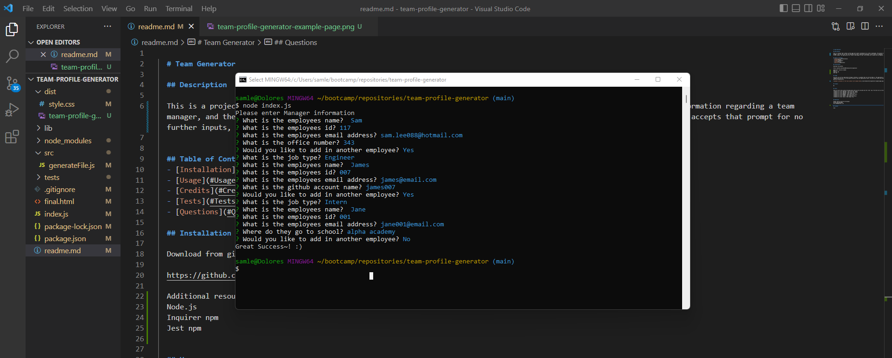
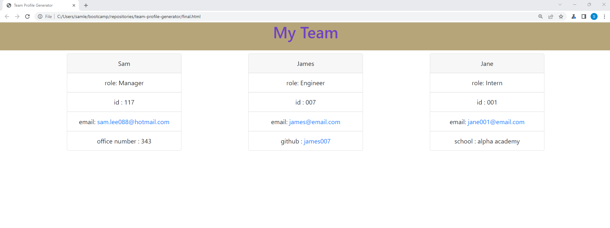

  # Team Generator

  ## Description

  This is a project that creates an html page with contact information for a team of employees. The project prompts for information regarding a team manager, and then the user has the optionality to add in additional employees, either Interns or Engineers. Once the user accepts that prompt for no further inputs, the application will create a HTML page for view. This project was created with an emphasis on Node.js. 

  ## Table of Contents
  - [Installation](#Installation)
  - [Usage](#Usage)
  - [Credits](#Credits)
  - [Tests](#Tests)
  - [Questions](#Questions)

  ## Installation

  Download from github:

  https://github.com/samlee088/team-profile-generator

  Additional resources needed:
  Node.js
  Inquirer npm
  Jest npm

  ## Usage

  The user can use this application through a terminal, ie gitbash that can utilize Node.js. The application can be started with the 'node index.js' command once the user is in the proper directory. Once the application starts, the user will follow the prompts until completion, and the HTML will generate automatically. 

  ## Credits

  NA

  ## Tests

  There are user tests within the application that can be utilized with the 'Jest' npm.

  ## Questions

  Please reach me with the following:
  github.com/samlee088
  sam.lee088@hotmail.com

  ## License

  none
 
